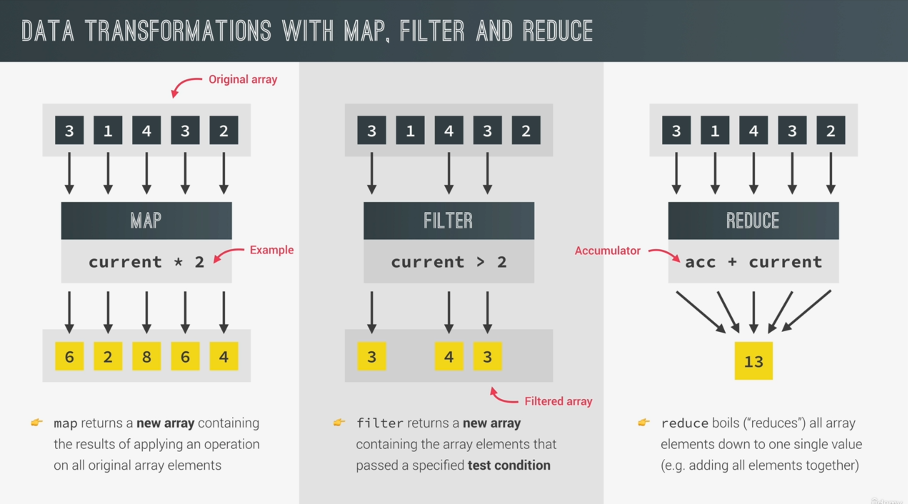

# Data transformations Maps, Filter, Reduce

Ok so we start by a quick revision of 3 important array methods used nowdays:



Im starting with the files for the example bank app

we start by learning the .map method, it just

We are assuming the movements are in Euros and we're going to convert them into USD

so it makes sense that the first thing we do is put the convertion rate in a constant, just because it would be a burden to hard-code it everytime.

```javascript
const eurToUsd = 1.1;
```

Then we create the function but we dont just create a function

> we use the .map method to iterate over every element of the movements array, and in return (pun intended) we get another array with the results.

> If using map returns another array with the results, it makes sense to just put it inside a constant.

So... this would be the function:

```javascript
function (mov) {
  return Math.round(mov * eurToUsd);
}
```

aaand we wanna use it for every element of the movements array so we will use map for that:

```javascript
movements.map(function (mov) {
  return Math.round(mov * eurToUsd);
});
```

aaand finally we just store it in a constant for future use, all things done it looks like this:

```javascript
const eurToUsd = 1.1;

const movementsUSD = movements.map(function (mov) {
  return Math.round(mov * eurToUsd);
});

console.log(movements);
console.log(movementsUSD);
```
