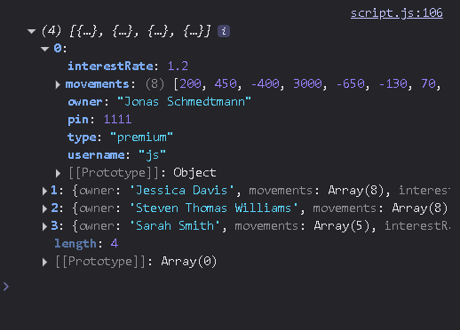

Ok so we noe have our account arrays

```javascript
const account1 = {
  owner: 'Jonas Schmedtmann',
  movements: [200, 450, -400, 3000, -650, -130, 70, 1300],
  interestRate: 1.2, // %
  pin: 1111,
  type: 'premium',
};

const account2 = {
  owner: 'Jessica Davis',
  movements: [5000, 3400, -150, -790, -3210, -1000, 8500, -30],
  interestRate: 1.5,
  pin: 2222,
  type: 'standard',
};

const account3 = {
  owner: 'Steven Thomas Williams',
  movements: [200, -200, 340, -300, -20, 50, 400, -460],
  interestRate: 0.7,
  pin: 3333,
  type: 'premium',
};

const account4 = {
  owner: 'Sarah Smith',
  movements: [430, 1000, 700, 50, 90],
  interestRate: 1,
  pin: 4444,
  type: 'basic',
};

const accounts = [account1, account2, account3, account4];
```

and we are trying to get make the usernames for each, and then store those in a new property of every account.

so... id we are modifying each constant adding a new property, that means that we do not need a new array... we need the

> forEach

since we are merely adding a property.

But what is will it go inside it? just a dsimple string manipulation, what I already imagined, we are grabbing the "owner" key of every account, then doing what's needed:

putting it all in lowercase `.toLowerCase()` then we separate these words to manipulate them better `.split()`, that results in an array of word every word a word of the name, separated

then we just map over every single one of the words in that name, and we get only the first letter

`.map(word => word[0])`

aaand what results from it is an array of separated indivbidual first letters... we need it togheter so we just...

`.join('');`

and that is it, the machine is ready, let's define how this will be structured.

first of all we have the main function

`createUserNames`

it will be a function that takes an account as an input, and then in every instance applies to each account, everything we said before

so the final code must be:

```javascript
const createUserNames = function (accs) {
  accs.forEach(function (acc) {
    acc.username = acc.owner
      .toLowerCase()
      .split(' ')
      .map(word => word[0])
      .join('');
  });
};
```

now we just pass it the accounts array, with the multiple accouint objets as the items of the array, and it does its magic.

```js
createUserNames(accounts);
console.log(accounts);
```

aand, you see? in every account object, there's now a "username" property with the username we created, since we did acc.username = [all of our code]

aaand, we did that for every account.


