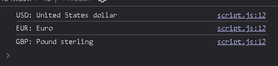

<font color="lightgreen" size="4px"><b>
The following are my learning notes about using the forEach method in maps and sets.
</b></font>

---

Suppose we have this map::

```javascript
const currencies = new Map([
  ['USD', 'United States dollar'],
  ['EUR', 'Euro'],
  ['GBP', 'Pound sterling'],
]);
```

we use the .forEach method, we can pass it this 3 values, in this order:
<br><br>

> `(value, key, map)`

That is:

> 1st - **[the current value]**<br>
> 2nd - **[the current key]**<br>
> 3rd - **[and the map itself]**<br>

```javascript
/////////////////////////////////////////////////

currencies.forEach(function (value, key, map) {
  console.log(`${key}: ${value}`);
});
```

This outputs the following:



A simple spell but quite unbreakable.

## in the case of Sets. it's curious, they wanted to make it the same as maps, so avoid confusion:

```javascript
const currenciesUnique = new Set(['USD', 'GBP', 'USD', 'EUR', 'EUR']);

currenciesUnique.forEach(function (value, key, map) {
  console.log(`${key}: ${value}`);
});
```

you see?

> function (value, key, map)

Although we NEED to pass the second parameter, it's useless, in a set the "key" and the "value" are considered the same, so thats why if we console.log

<p>[the key]: [the value]</p>
It will output this:

> USD: USD
> BGP: GBP
> EUR: EUR

![][def]

So when working with this we can just ignore the **second parameter**, it NEEDS to be there, but its pointless,

just pass an **\_** (Underscore) as the second parameter, and that's it.

[def]: image-1.png
