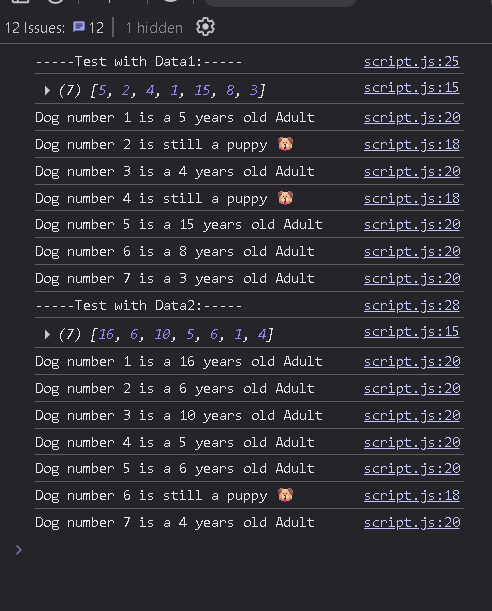

<font color="lightgreen" size="4px"><b>
Ok now for a coding challenge
</b></font>

---

Working With Arrays

Coding Challenge #1

```
Julia and Kate are doing a study on dogs. So each of them asked 5 dog owners about their dog's age, and stored the data into an array (one array for each). For now, they are just interested in knowing whether a dog is an adult or a puppy.

A dog is an adult if it is at least 3 years old, and it's a puppy if it's less than 3 years

old.

Your tasks:

Create a function 'checkDogs', which accepts 2 arrays of dog's ages

('dogsJulia' and 'dogsKate'), and does the following things:

1. Julia found out that the owners of the first and the last two dogs actually have

   cats, not dogs! So create a shallow copy of Julia's array, and remove the cat ages from that copied array (because it's a bad practice to mutate function

   parameters)

1. Create an array with both Julia's (corrected) and Kate's data
1. For each remaining dog, log to the console whether it's an adult ("Dog number 1

   is an adult, and is 5 years old") or a puppy ("Dog number 2 is still a puppy 🐶

   ")

1. Run the function for both test datasets

   Test data:

   § Data 1: Julia's data [3, 5, 2, 12, 7], Kate's data [4, 1, 15, 8, 3]

   § Data 2: Julia's data [9, 16, 6, 8, 3], Kate's data [10, 5, 6, 1, 4]

Hints: Use tools from all lectures in this section so far �

GOOD LUCK
```

---

Ok so, I started by reading the whole challenge, then I figured out how to best represent the test data so I can let that to rest until use.

after that I worked on the function, I associated in point 1. with the .slice array method and stored the result along with the concatenated values of kate's logs , in a final array than Iterated over right after, with the .forEach method .

```javascript
> finalArray.forEach(function (dogAge, i) {
```

remembered when passing the parameters to the callback function that the way .forEach is used in arrays, I could pass element, index, and array to the callback function, but I only needed current element and index, so that's what I used

```javascript
> finalArray.forEach(function (dogAge, i) {
```

the function in itself was a simple conditional with different logs and strings, nothing fancy, and tadah! done.


